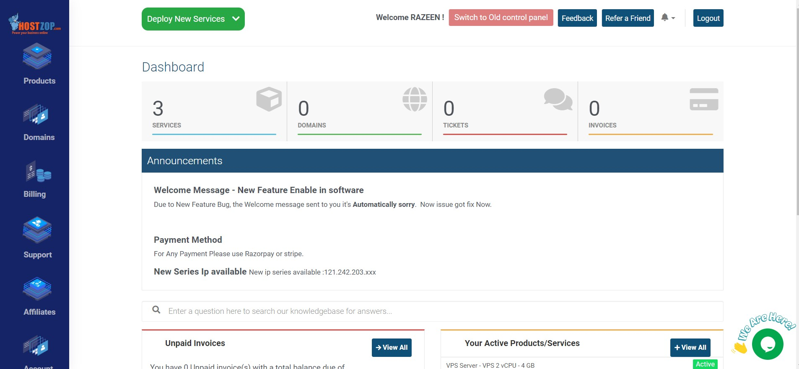
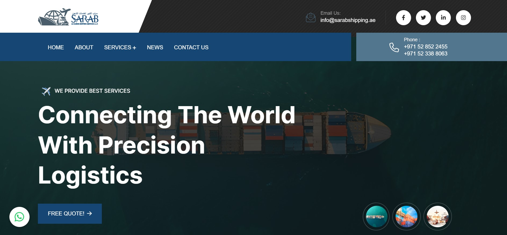
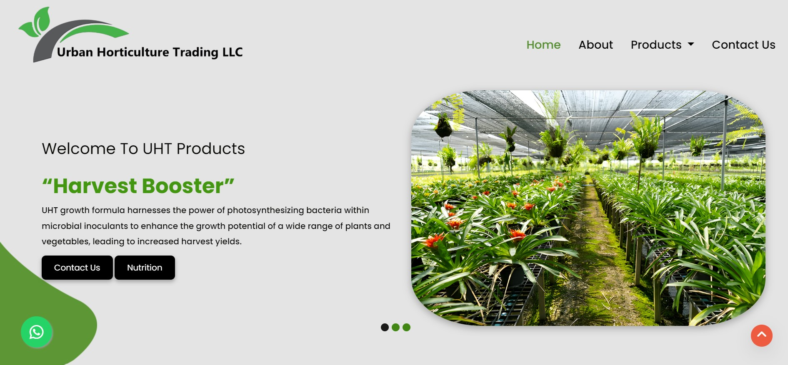

<h2 align="center">Welcome to Universe Of < RAZEEN />
<picture></picture>
</h2>

  

<h3 align="center">Full-stack Developer | Software Engineer | Diploma in Counseling Psychology</h3>

Hello there! I’m **Razeen**, a passionate **Full Stack Developer** with a knack for building scalable and interactive web applications. From crafting intuitive UIs to integrating robust backends, I thrive on delivering impactful digital solutions.  

Feel free to visit my personal portfolio for more details: [Razeen's Portfolio](https://razeen-portfolio.vercel.app/)

---

### 
My Technical Skills

    

---
<h2> About Me </h2>

- 🔭 I’m currently working as a **Full-stack Developer** at **HOSTZOP CLOUD SERVICES PRIVATE LIMITED**.

- 🌱 I’m currently learning **Next.js**, **Data Structures**, and **Algorithms** to improve my development skills.

- 👯 I’m looking to collaborate on **web development projects**, especially focused on building scalable and interactive applications.

- 💬 Ask me about **SQL**, **JavaScript**, **React.js**, **Node.js**, **PHP**, and **MongoDB**.

- ⚡ Fun fact: I love solving coding challenges and exploring new technologies in web development.

---

## 🛠️ **Tech Stack**

| **Category**        | **Technologies**                                                                                                                                             |
|---------------------|-------------------------------------------------------------------------------------------------------------------------------------------------------------|
| **Frontend**        |   &nbsp; &nbsp;   &nbsp; &nbsp;   &nbsp; &nbsp;   &nbsp; &nbsp;  |
| **Backend**         |   &nbsp; &nbsp;   &nbsp; &nbsp;   &nbsp; &nbsp;   &nbsp; &nbsp;  |
| **Databases**       |   &nbsp; &nbsp;   &nbsp; &nbsp; |
| **Tools & Platforms** |   &nbsp; &nbsp;   &nbsp; &nbsp;  |

---

## 💼  Client Projects

### 🏢 **Hostzop Client Dashboard**  

- Interactive dashboard for billing details, work requests, and lost items tracking.  
- **My Work**: Designed the UI/UX, integrated APIs, and implemented data visualizations using D3.js.  
- **Tech Stack**: HTML, CSS, JavaScript, D3.js  
 
 

---

## 💼  Freelancing Projects

### 🌍 **Sarab Shipping Website**  

- Fast and responsive website for a logistics company, enhancing client accessibility.  
- **My Work**: Developed a fully optimized, mobile-friendly design with a focus on simplicity and usability.  
- **Tech Stack**: HTML, CSS, JavaScript, PHP  
- **[Live Website](https://sarabshipping.ae/)**  

---

### 🍴 **Aryaa Foods Website**  

- Interactive and animated website for showcasing food products.  
- **My Work**: Designed the site using Figma, developed with React.js and Node.js, ensuring responsiveness.  
- **Tech Stack**: React.js, TailwindCSS, Three.js, Framer Motion  
- **[Live Website](https://aryaa-react-new.vercel.app/)**  

---

### 🌱 **Urban Horticulture Trading** 

- Modern single-page website highlighting agricultural solutions.  
- **My Work**: Built the platform with a clean, mobile-first approach for optimal performance.  
- **Tech Stack**: HTML, CSS, JavaScript, PHP  
- **[Live Website](https://urbanhorticulturetrading.com/)**  

---

### 🤖 **Face Recognition Attendance System**  

- A secure and contactless attendance system leveraging face recognition.  
- **My Work**: Handled data modeling, face detection using CVzone, and Firebase integration.  
- **Tech Stack**: Python, CVzone, Numpy, Firebase  
- **[GitHub Repository](https://github.com/Razeen23/Face-recognition-and-object-deducting-for-companys)**  

---

## 🌟 **Achievements**
🏆 **Best Performer Award**: Internship program at Aspire Systems.  
👨‍💼 **Leadership**: Led a 10-member crew in an NCC camp.  
🌊 **Rescue Work**: Member of a disaster rescue team for flood relief operations.  

---

## 📈 **GitHub Stats**

<be>

   

  
<!--  
  
  
  
  -->
  
  

---

## 🤝 **Hire Me**

**Why Hire Me?**  
I bring proven experience in full-stack development with technologies like **React.js**, **Node.js**, **PHP**, and **MongoDB**. I’m passionate about building scalable, user-friendly web applications and continuously learning to stay updated with new technologies like **Next.js**. With a strong work ethic, problem-solving skills, and a focus on delivering results, I’m confident I can contribute to your team’s success.

  

